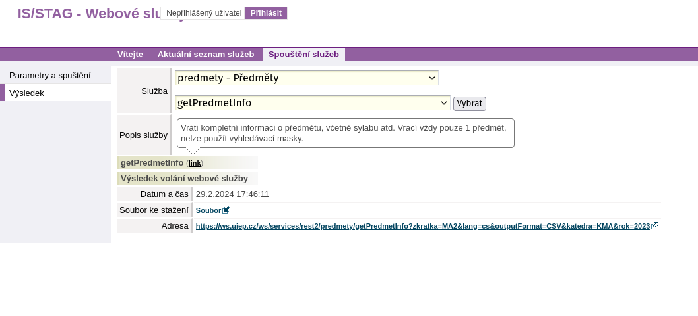

# __Webové služby STAG__

Tato část se věnuje tomu, jak lze data ze STAGu načíst.

- [Odkaz na WS](https://ws.ujep.cz/ws/web)
- [Dokumentace](https://is-stag.zcu.cz/napoveda/web-services/ws_ws.html)

## Instalace knihoven

Stažení nástrojů pro posílání http requestů a případně zpracování dat.

=== "pip"

    ```bash
    pip install requests pandas
    ```
    Pandas slouží jako nástroj pro práci s daty. Umožňuje načítat data z různých zdrojů, jako jsou například CSV nebo JSON. Dále umožňuje manipulaci s daty, jako je filtrování, agregace, nebo spojování.

    - [Dokumentace](https://pandas.pydata.org/docs/)

    Requests je knihovna pro posílání http requestů.

    - [Dokumentace](https://docs.python-requests.org/en/master/)

=== "Poetry"

    ```bash
    poetry add requests pandas
    ```
    Pandas slouží jako nástroj pro práci s daty. Umožňuje načítat data z různých zdrojů, jako jsou například CSV nebo JSON. Dále umožňuje manipulaci s daty, jako je filtrování, agregace, nebo spojování.

    - [Dokumentace](https://pandas.pydata.org/docs/)

    Requests je knihovna pro posílání http requestů.

    - [Dokumentace](https://docs.python-requests.org/en/master/)

=== "<span style="color:#276DC3">:fontawesome-brands-r-project:</span>"

    ```r
    install.packages(c("httr", "readr"))
    ```
    Jazyk R nepotřebuje žádnou další knihovnu pro práci s daty.

    Knihovna `httr` slouží k posílání http requestů.

    - [Dokumentace](https://cran.r-project.org/web/packages/httr/index.html)

    Readr slouží k načítání dat formátu například CSV nebo JSON.

    - [Dokumentace](https://readr.tidyverse.org/)

Více o http requestech [zde](https://developer.mozilla.org/en-US/docs/Web/HTTP/Methods).

## Request na webové služby

### Request bez přihlášení

Template pro request na webové služby.

=== "<span style='color:#306998'>:fontawesome-brands-python: Python</span>"

    ```python
    import requests
    import pandas as pd
    from io import StringIO

    url = "https://ws.ujep.cz/ws/services/rest2/test/endpoint"
    params = {
        "outputFormat": "CSV",
        "outputFormatEncoding": "utf-8",
    }

    data = requests.get(
        url,
        params=params,
    )

    df = pd.read_csv(StringIO(data.text), sep=";")
    ```
=== "<span style="color:#276DC3">:fontawesome-brands-r-project:</span>"

    ```r
    library(httr)
    library(readr)

    url <- "https://ws.ujep.cz/ws/services/rest2/test/endpoint"
    params <- list(
        outputFormat = "CSV",
        outputFormatEncoding = "utf-8"
    )

    data <- GET(
        url,
        query = params
    )

    df <- read_csv2(rawToChar(data$content))
    ```

K odeslání requestu je potřeba znát __url__ služby a __url parametry__ (také jako __query parametry__, dále jen __parametry__), které služba vyžaduje.

#### Request `/predmety/getPredmetInfo`

Na ukázku jeden konkrétní příklad. [`/predmety/getPredmetInfo`](https://ws.ujep.cz/ws/form/predmety/getPredmetInfo)

Výše uvedený odkaz otevře rozhraní služby `/predmety/getPredmetInfo`. K vyplnění je zde několik __parametrů__. Červenou hvězdičkou jsou označeny povinné parametry. Bez těchto __parametrů__ nelze request odeslat (resp. server vrátí status kód `500 - Internal Server Error`).

Služba s vyplněnými __parametry__ vypadá následovně:

{ align=left }

Po odeslání requestu se zobrazí výsledek volání webové služby. Kromě konkrétního souboru ke stažení nás hlavně zajímá __Adresa__. Z té vyčteme __url__ a názvy jednotlivých __parametrů__.

{ align=left }

??? note "Url parametry"
    Parametry a jejch hodnoty se v adrese nacházejí za otazníkem.
    V našem případě vypadá takto:

    `?katedra=KMA&zkratka=MA2&rok=2023&lang=cs&outputFormat=CSV&outputFormatEncoding=utf-8`.

    Jednotlivé parametry a jejich hodnoty jsou ve formátu `parametr=hodnota`. Mezi jednotlivými parametry je oddělovač `&`. Naše parametry v tomto případě jsou:

    <center>

    | Parametr | Hodnota |
    | :-------- | :------- |
    | katedra  | KMA     |
    | zkratka  | MA2     |
    | rok      | 2023    |
    | lang     | cs      |
    | outputFormat | CSV |

    </center>

Po doplnění správné __url__ a __parametrů__ by request na tuto službu vypadal následovně:

=== "<span style='color:#306998'>:fontawesome-brands-python: Python</span>"

    ```python
    import requests
    import pandas as pd
    from io import StringIO

    url = "https://ws.ujep.cz/ws/services/rest2/predmety/getPredmetInfo"

    params = {
        "katedra": "KMA",
        "zkratka": "MA2",
        "rok": "2023",
        "lang": "cs",
        "outputFormat": "CSV",
        "outputFormatEncoding": "utf-8"
    }

    data = requests.get(
        url,
        params=params,
    )

    df = pd.read_csv(StringIO(data.text), sep=";")
    ```
=== "<span style="color:#276DC3">:fontawesome-brands-r-project:</span>"

    ```r
    library(httr)
    library(readr)

    url <- "https://ws.ujep.cz/ws/services/rest2/predmety/getPredmetInfo"

    params <- list(
        katedra = "KMA",
        zkratka = "MA2",
        rok = "2023",
        lang = "cs",
        outputFormat = "CSV",
        outputFormatEncoding = "utf-8"
    )

    data <- GET(
        url,
        query = params
    )

    df <- read_csv2(rawToChar(data$content))
    ```

???+ warning "Encoding"
    Soubory ve formátu __CSV__ webové služby defaultně vrací v kódování __windows-1250__. Pro správné načtení dat je potřeba přidat parametr `outputFormatEncoding=utf-8`.
    [Dokumentace](https://is-stag.zcu.cz/napoveda/web-services/ws_formaty.html)

### Request s přihlášením

++f12++

{ align=left }

=== "<span style='color:#306998'>:fontawesome-brands-python: Python</span>"

    ```python
    import requests
    import pandas as pd
    from io import StringIO

    url = "https://ws.ujep.cz/ws/services/rest2/kvalifikacniprace/getKvalifikacniPraceAuth"

    ticket = "your_ticket"

    params = {
        "katedra": "KI",
        "outputFormat": "CSV",
        "outputFormatEncoding": "utf-8"
    }

    data = requests.get(url, params=params, cookies={"WSCOOKIE": ticket})

    df = pd.read_csv(StringIO(data.text), sep=";")
    ```

=== "<span style="color:#276DC3">:fontawesome-brands-r-project:</span>"

    ```r
    library(httr)
    library(readr)

    url <- "https://ws.ujep.cz/ws/services/rest2/kvalifikacniprace/getKvalifikacniPraceAuth"

    ticket <- "your_ticket"

    params <- list(
        "katedra" = "KI",
        "outputFormat" = "CSV",
        "outputFormatEncoding" = "utf-8"
    )

    data <- GET(
        url,
        query = params,
        add_headers("Cookie" = paste("WSCOOKIE", ticket, sep = "="))
    )

    df <- read_csv2(rawToChar(data$content))
    ```
