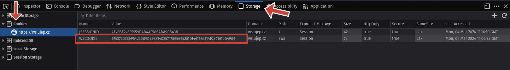

# __Request s přihlášením__

## __WS Cookie__

++f12++

{ align=left }

=== "<span style='color:#306998'>:fontawesome-brands-python: Python</span>"

    ```python hl_lines="7 15"
    import requests
    import pandas as pd
    from io import StringIO

    url = "https://ws.ujep.cz/ws/services/rest2/kvalifikacniprace/getKvalifikacniPraceAuth"

    ticket = "your_ticket"

    params = {
        "katedra": "KI",
        "outputFormat": "CSV",
        "outputFormatEncoding": "utf-8"
    }

    data = requests.get(url, params=params, cookies={"WSCOOKIE": ticket})

    df = pd.read_csv(StringIO(data.text), sep=";")
    ```

=== "<span style="color:#276DC3">:fontawesome-brands-r-project:</span>"

    ```r
    library(httr)
    library(readr)

    url <- "https://ws.ujep.cz/ws/services/rest2/kvalifikacniprace/getKvalifikacniPraceAuth"

    ticket <- "your_ticket"

    params <- list(
        "katedra" = "KI",
        "outputFormat" = "CSV",
        "outputFormatEncoding" = "utf-8"
    )

    data <- GET(
        url,
        query = params,
        add_headers("Cookie" = paste("WSCOOKIE", ticket, sep = "="))
    )

    df <- read_csv2(rawToChar(data$content))
    ```

## __Přihlašovací údaje do STAGu__

=== "<span style='color:#306998'>:fontawesome-brands-python: Python</span>"

    ```python
    import pandas as pd
    import requests
    import os
    from io import StringIO
    from dotenv import load_dotenv

    load_dotenv()

    user = os.getenv("STAG_USER")
    password = os.getenv("STAG_PASSWORD")

    url = "https://ws.ujep.cz/ws/services/rest2/kvalifikacniprace/getKvalifikacniPraceAuth"
    params = {
        "katedra": "KI",
        "outputFormat": "CSV",
        "outputFormatEncoding": "utf-8"
    }
    auth = (user, password)
    data = requests.get(url, params=params, auth=auth)

    df = pd.read_csv(StringIO(data.text), sep=";")
    ```

=== "<span style="color:#276DC3">:fontawesome-brands-r-project:</span>"

    ```r
    library(httr)
    library(readr)

    user <- Sys.getenv("STAG_USER")
    password <- Sys.getenv("STAG_PASSWORD")
    
    url <- "https://ws.ujep.cz/ws/services/rest2/kvalifikacniprace/getKvalifikacniPraceAuth"
    params <- list(
        "katedra" = "KI",
        "outputFormat" = "CSV",
        "outputFormatEncoding" = "utf-8"
    )

    data <- GET(
        url,
        query = params,
        authenticate(user, password),
        encode = "UTF-8"
    )

    df <- read_csv2(rawToChar(data$content))
    ```
