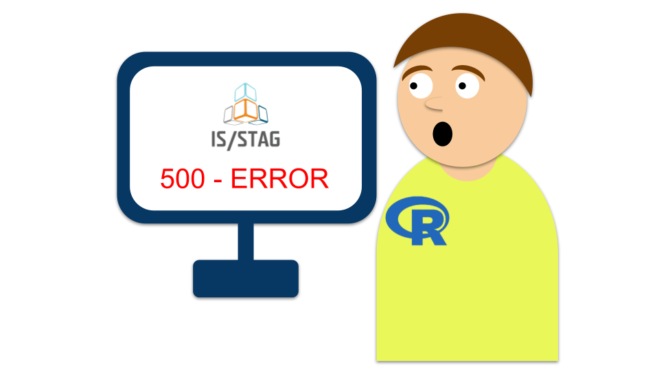
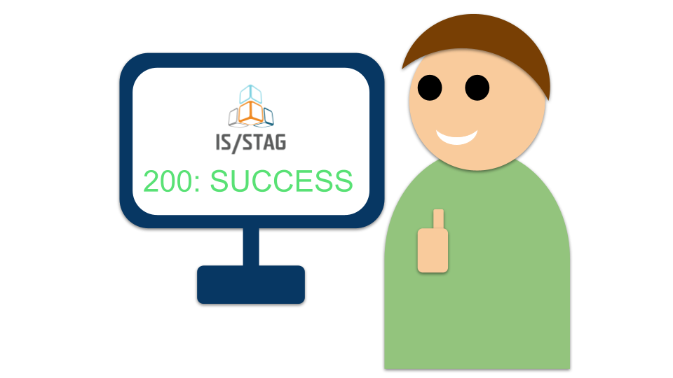

---
hide:
  - navigation
---

# __STAG projekty__

Tato dokumentace vzníká v rámci předmětu KMA/PS1 — PS4.

Cílem je vytvořit návod (nejen) pro studenty, kteří chtějí pracovat s daty poskytovanými webovými službami STAGu a využívat je k vytváření webových aplikací.

- :fontawesome-solid-book:{ .lg .middle } __Návody__

    ---

    Jak pracovat s webovými službami STAGu? Jak přidat do webové aplikace přilašování přes STAG?

    [:octicons-arrow-right-24: Návody](guide/index.md)

- :fontawesome-solid-diagram-project:{ .lg .middle } __Projekty__

    ---

    Dokumentace k jednotlivým projektům.

    [:octicons-arrow-right-24: Projekty](projects/index.md)

## Použité technologie

Dokumentace je primárně zaměřena na jazyk Python, ale v některých částech se vyskytují i ukázky kódu v jazyce R.

Pro vývoj aplikací je používána knihovna [Streamlit](https://streamlit.io/){ data-preview }.

Zpracování dat pomocí knihovny [Pandas](https://pandas.pydata.org/docs/).

## From zero to hero

Před přečtením dokumentace 💀:

Po přečtení dokumentace 😄:

