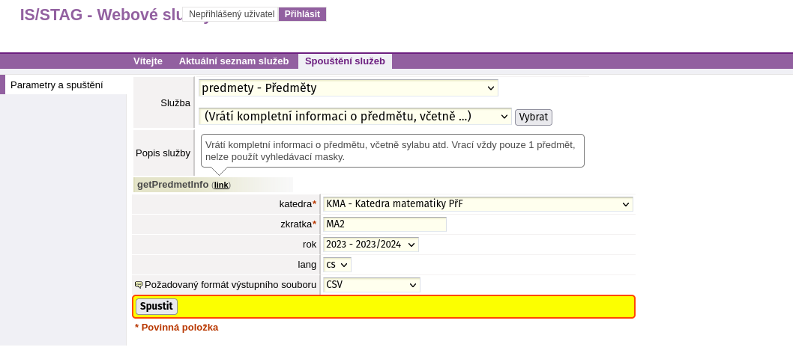
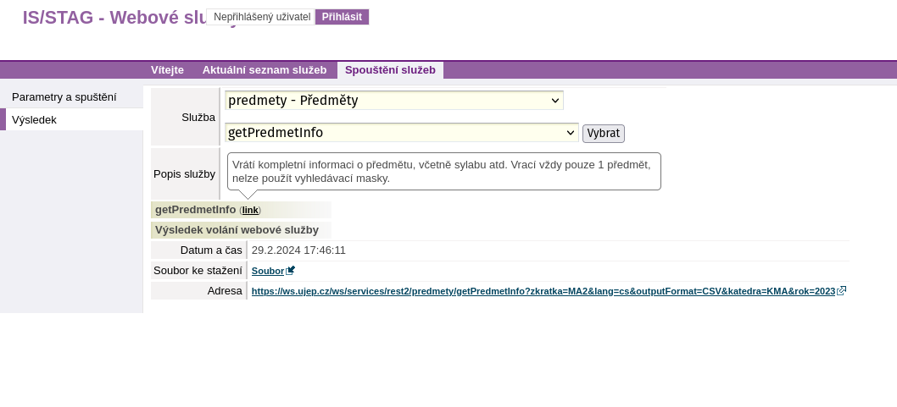

# Webové služby STAG

- [Odkaz na WS](https://ws.ujep.cz/ws/web)
- [Dokumentace](https://is-stag.zcu.cz/napoveda/web-services/ws_ws.html)

## Python

### Instalace balíčků

```bash
pip install requests pandas
```

### Request na webové služby

```python
import requests
from io import StringIO
import pandas as pd

url = "https://ws.ujep.cz/ws/services/rest2/test/endpoint"
params = {
    "lang": "cs",
    "outputFormat": "CSV",
    "outputFormatEncoding": "utf-8",
}

data = requests.get(
    url,
    params=params,
)

df = pd.read_csv(StringIO(data.text), sep=";")
```

<figure markdown="span">
  { align=left }
  <figcaption>Náhled spouštění WS</figcaption>
</figure>

<figure markdown="span">
  { align=left }
  <figcaption>Náhled výstupu WS</figcaption>
</figure>

Konkrétní request na webové služby by vypadal následovně:

```python
import requests
from io import StringIO
import pandas as pd

url = "https://ws.ujep.cz/ws/services/rest2/predmety/getPredmetInfo"

params = {
    "katedra": "KMA",
    "zkratka": "MA2",
    "rok": "2023",
    "lang": "cs",
    "outputFormat": "CSV",
    "outputFormatEncoding": "utf-8"
}

data = requests.get(
    url,
    params=params,
)

df = pd.read_csv(StringIO(data.text), sep=";")
```
